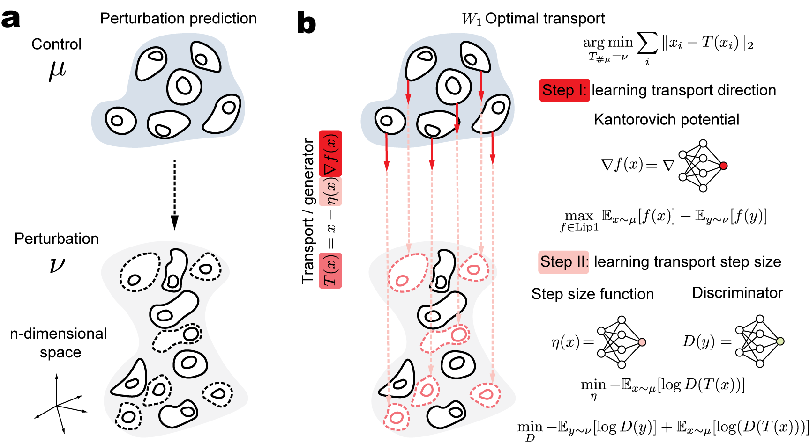

# W1OT: Wasserstein-1 Neural Optimal Transport Solver

## Overview




## Installation

```bash
# direct installation
pip install git+https://github.com/poseidonchan/w1ot.git
# Or, clone the repo and install it
# git clone https://github.com/poseidonchan/w1ot.git
# cd w1ot
# pip install -e .
```

## Usage
For general usage:
```python
from w1ot import w1ot, w2ot
from w1ot.data import make_2d_data, plot_2d_data

# create the toy data for training
source, target = make_2d_data(dataset='circles', n_samples=2**17, noise=0.01)
# initialize the model
model = w1ot(source, target, 0.1, device,  path='./saved_models/w1ot/circles')
# fit the Kantorovich potential
model.fit_potential_function(num_iters=10000,resume_from_checkpoint=True)
# visualize the Kantorovich potential
model.plot_2dpotential()
# fit the step size
model.fit_distance_function(num_iters=10000, resume_from_checkpoint=True)

# create the testing data
source, target = make_2d_data(dataset='circles', n_samples=2000, noise=0.01)
# apply the learned transport map
transported = model.transport(source)
# visualize the result without markers
plot_2d_data(source, target, transported, False, 0.5)

# Alternative: w2ot
# model = w2ot(source, target, 0.1, device,  path='./saved_models/w2ot/circles')
# model.fit_potential_function(num_iters=10000, resume_from_checkpoint=True)
# transported = model.transport(source)
```
For single-cell data in h5ad format:
```python
from w1ot.experiment import PerturbModel
# data requirment: the model will automatically doing the normalization and log1p transformation if the max value exceeds 50.
# If you have already preprocessing it, you should refer to the general usage above to directly use w1ot model, which offers more flexibility.

# Initialization
model = PerturbModel(model_name="w1ot", # also support "w2ot", "scgen"
                     source_adata=source_train_adata, # data must be splitted at first
                     target_adata=target_train_adata, # data must be splitted at first
                     perturbation_attribute=perturbation_attribute, # it is only used in the evaluation process
                     latent_dim=8,
                     embedding=True, # whether to use the embedding model (vae), if used, then the OT is doing on the latent space. 
                     output_dir=model_output_dir,
                     hidden_layers=[32, 32], # hidden layer size for the embedding model.
                     num_iters=10000, # training iteration for the embedding model
                     device="cuda")
# Training
model.train()
# Inference
transported_adata = model.predict(source_test_adata) # the transported_adata will have the same meta data with source_test_adata
# Evaluation
metrics = model.evaluate(source_adata, 
                         target_adata, 
                         top_k=50 # this is using the topk DEGs for evaluation. It will automatically calculate the DEGs using scanpy.tl.rank_genes_group
                        )

# if using embedding model, it will evaluate the performance on both embedding space and cell space. Otherwise, embedding_* is np.nan
embedding_r2, embedding_l2, embedding_mmd, cell_r2, cell_l2, cell_mmd = metrics

```
## Experiments

To reproduce the experiments efficiently, we suggest you install the ***Ray (2.37.0)*** and configure your own Ray clusters. After that you can run the experiments codes in the Experiments folder.

```bash
# for example:
python ./Experiments/4i.py
```

If you do not have access to enough computation resources, the reproducing procedure could be very slow (since the w2ot model consumes a lot of time).

## Citation

```bibtex
@misc{chen2024fastscalablewasserstein1neural,
      title={Fast and scalable Wasserstein-1 neural optimal transport solver for single-cell perturbation prediction}, 
      author={Yanshuo Chen and Zhengmian Hu and Wei Chen and Heng Huang},
      year={2024},
      eprint={2411.00614},
      archivePrefix={arXiv},
      primaryClass={cs.LG},
      url={https://arxiv.org/abs/2411.00614}, 
}
```


## Contact

If you have any questions, feel free to email cys@umd.edu
